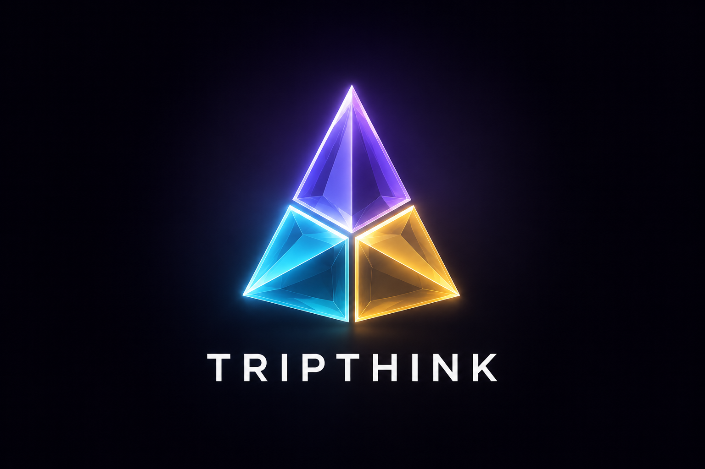

<p align="center">
  
  
  
  
  
</p>

<p align="center">
  
</p>

# TripThink

**Three LLMs. Three methodologies. One toolkit.**

TripThink orchestrates structured multi-model deliberation for complex reasoning tasks that a single model would botch. Three independent LLMs run in parallel through purpose-built pipelines — convergent synthesis, adversarial stress-testing, or evidence-interleaved investigation.

> **Why 3 models?** Independent models produce uncorrelated errors. What one model misses, another catches. Cross-pollinating across three different architectures consistently outperforms any single model on open-ended reasoning.

---

## Quick Install

```bash
# Method 1: curl | bash (works everywhere, auto-detects your AI tools)
curl -fsSL https://raw.githubusercontent.com/ZhijunLStudio/tripthink/main/install.sh | bash

# Method 2: Claude Code Plugin
/plugin marketplace add ZhijunLStudio/tripthink
/plugin install tripthink@ZhijunLStudio

# Method 3: Manual
git clone https://github.com/ZhijunLStudio/tripthink.git
cd tripthink && bash install.sh
```

During install, the script auto-detects which AI tools you have (Claude Code, Codex, Cursor, Windsurf, OpenCode, Gemini CLI, Copilot...) and installs to all of them. Then it walks you through model configuration — OpenRouter (one key, 300+ models) or individual APIs.

### Requirements
- Python 3.9+
- `httpx` — auto-installed if missing
- API key(s) — get them from your provider of choice (OpenRouter, DeepSeek, Anthropic, OpenAI, Volces Ark, etc.)

---

## Skills

| Skill | Method | Rounds | Output | Use when |
|-------|--------|--------|--------|----------|
| `/tripthink-deep` | Blind→Cross-Pollinate→Converge | 3 | Synthesized position + minority report | Complex strategy, open-ended questions |
| `/tripthink-debate` | Role-locked adversarial dialectic | 2 | Per-crux ruling + damage report | Stress-testing proposals |
| `/tripthink-research` | Hypothesis→Verify→Revise→Converge | 2+ looping | Calibrated report + evidence ledger | Questions needing factual grounding |

### `/tripthink-deep` — Convergent Deliberation

```
User question
    │
Phase 1: Decompose → problem_card (sharpened, scoped, success criteria)
    │
Phase 2: Blind seeding — 3 models, no peer exposure, forced to commit
    │
Phase 3: Cross-pollination — each model critiques the other two
    │
Phase 4: Reconciliation matrix — claims mapped to agreement/dispute
    │
Phase 5: Convergent synthesis — hybrid position, NO averaging
    │
Phase 6: Audit — each model signs off or files formal dissent
    │
  🧠 Structured report + minority report
```

**Best for:** Architecture decisions, strategy formulation, research framing — any question where a single model's blind spot costs you.

### `/tripthink-debate` — Adversarial Stress-Test

```
Proposition
    │
Phase 1: Crystallize — sharpen, scope, make falsifiable
    │
Phase 2: Assign roles — Steelman (FOR) / Critic (AGAINST) / Analyst (NEUTRAL)
    │
Phase 3: Opening statements — tagged crux claims + attacks
    │
Phase 4: Rebuttal ×2 — quote the opponent, counter, defend/concede/refine
    │
Phase 5: Draft adjudication — per-crux ruling grid
    │
Phase 6: Last-word review — losing side reviews DRAFT before it's final
    │
  ⚖️ Verdict: PROCEED / MODIFY / ABANDON + surviving objections + damage report
```

**Best for:** Evaluating architectural proposals, product decisions, research hypotheses — high-stakes ideas that must survive adversarial scrutiny.

### `/tripthink-research` — Evidence-Interleaved Investigation

```
Research question
    │
Phase 0: Mode select — deep-research / lightweight / post-hoc
    │
Phase 1: 3 models propose hypotheses with priors + falsifiers
    │
Phase 2: Gap-ID — deduplicate evidence needs, prioritize by leverage
    │
Phase 3: Verify — WebSearch / deep-research per gap. Grade every source.
    │
Phase 4: Revise — models revise or retire hypotheses based on evidence
    │
Phase 5: Convergence check — LOOP / CONVERGED / EXHAUSTED (oscillation guard)
    │                            │
    └──────── Iterate ──────────┘
    │
  🔬 Calibrated belief report + evidence ledger + unresolved gaps
```

**Best for:** Pre-decision due diligence, claims needing factual verification, any question where you need to distinguish *known* from *inferred*.

> **tripthink-research vs deep-research:** deep-research tells you what the sources say. tripthink-research tells you whether 3 independent reasoners reach the same conclusions from those sources — interpretation robustness vs source quality.

---

## Supported Platforms

TripThink installs to every AI coding tool it detects. The skills work identically everywhere — same pipeline, same script, same output.

| Platform | Install Path | Invocation |
|----------|-------------|------------|
| **Claude Code** | `~/.claude/skills/` | `/tripthink-deep`, `/tripthink-debate`, `/tripthink-research` |
| **Codex CLI** | `~/.agents/skills/` | Skill auto-loaded |
| **OpenCode** | `~/.config/opencode/skills/` | Skill auto-loaded |
| **Gemini CLI** | `~/.gemini/skills/` | Skill auto-loaded |
| **GitHub Copilot** | `~/.copilot/skills/` | Skill auto-loaded |
| **Cursor** | `.cursor/skills/` (per-project) | Skill auto-loaded |
| **Windsurf** | `.windsurf/rules/` (per-project) | Rules auto-loaded |
| **Kiro / Roo Code / Cline / Goose** | Respective skill dirs | Skill auto-loaded |
| **Aider / Continue.dev** | Manual | Copy prompt templates into config |
| **Any shell** | `~/.tripthink/` (universal) | `python3 $TRIPTHINK_HOME/scripts/tripthink.py dispatch --prompt "..."` |

---

## Configuration

### Model Selection Guide

Choose 3 models for deliberation. **Diversity beats raw power** — different architectures catch different blind spots.

| Principle | Why | Example |
|-----------|-----|---------|
| **Mix architectures** | Different training, different inductive biases | Anthropic + Google + OpenAI models |
| **Mix sizes** | Large for depth, medium for speed | Opus + Sonnet + Haiku |
| **Consistent context** | Set max_tokens to the lowest among the 3 — prevents truncation asymmetry | If one has 80K and another 128K, use 81920 |
| **Similar latency** | Slowest model bottlenecks the pipeline | Avoid pairing a 20 tok/s model with a 200 tok/s model |
| **Recommended combo** | DeepSeek V4 Pro + GLM-5.1 + Kimi K2.6 — diverse architectures, similar speed, all Anthropic-compatible | See config.json for example endpoints |

### Setup Examples

#### OpenRouter (recommended — one key, 300+ models)

```jsonc
// $TRIPTHINK_HOME/config.json
{
  "_default_max_tokens": 81920,
  "models": {
    "model_a": {
      "name": "Claude Opus 4.8",
      "provider": "openrouter",
      "endpoint": "https://openrouter.ai/api/v1/chat/completions",
      "api_key_env": "OPENROUTER_API_KEY",
      "model": "anthropic/claude-opus-4-8",
      "max_tokens": 81920
    },
    "model_b": {
      "name": "Gemini 2.5 Pro",
      "provider": "openrouter",
      "endpoint": "https://openrouter.ai/api/v1/chat/completions",
      "api_key_env": "OPENROUTER_API_KEY",
      "model": "google/gemini-2.5-pro",
      "max_tokens": 81920
    },
    "model_c": {
      "name": "GPT-5",
      "provider": "openrouter",
      "endpoint": "https://openrouter.ai/api/v1/chat/completions",
      "api_key_env": "OPENROUTER_API_KEY",
      "model": "openai/gpt-5",
      "max_tokens": 81920
    }
  }
}
```

Set your key in `~/.zshrc` or `~/.bashrc`:
```bash
export OPENROUTER_API_KEY="sk-or-v1-..."
```

#### Individual APIs (separate keys per provider)

```jsonc
{
  "_default_max_tokens": 81920,
  "models": {
    "model_a": {
      "name": "DeepSeek V4 Pro",
      "provider": "anthropic",
      "endpoint": "https://api.deepseek.com/anthropic/v1/messages",
      "api_key_env": "DEEPSEEK_API_KEY",
      "model": "deepseek-v4-pro"
    },
    "model_b": {
      "name": "GLM-5.1",
      "provider": "anthropic",
      "endpoint": "https://ark.cn-beijing.volces.com/api/coding/v1/messages",
      "api_key_env": "ARK_API_KEY",
      "model": "glm-5.1"
    },
    "model_c": {
      "name": "GPT-5",
      "provider": "openai",
      "endpoint": "https://api.openai.com/v1/chat/completions",
      "api_key_env": "OPENAI_API_KEY",
      "model": "gpt-5"
    }
  }
}
```

### Provider types

| `provider` | API format | Header | Key field |
|-----------|-----------|--------|-----------|
| `openrouter` | OpenAI Chat Completions | `Authorization: Bearer` | `/v1/chat/completions` |
| `openai` | OpenAI Chat Completions | `Authorization: Bearer` | `/v1/chat/completions` |
| `anthropic` | Anthropic Messages | `x-api-key` | `/anthropic/v1/messages` |

### Config fields

| Field | Required | Default | Description |
|-------|----------|---------|-------------|
| `name` | Yes | — | Display name (any label) |
| `provider` | No | `anthropic` | `anthropic`, `openai`, or `openrouter` |
| `endpoint` | Yes | — | Full API URL |
| `model` | Yes | — | Model ID string sent to API |
| `api_key` | Either | — | Inline API key (less secure) |
| `api_key_env` | Either | — | Environment variable name containing the key |
| `max_tokens` | No | `_default_max_tokens` (8192) | Per-model override |
| `_default_max_tokens` | No | 81920 | Global fallback — set to your models' minimum context |
| `_timeout_seconds` | No | 120 | Per-request timeout |
| `_concurrency` | No | 6 | Max parallel requests |

---

## Architecture

```
~/.tripthink/                          # $TRIPTHINK_HOME (shared runtime)
├── config.json                        # ← Single source of truth
└── scripts/
    ├── tripthink.py                   # Parallel dispatcher (asyncio, multi-provider)
    └── query.py                       # Single-model query

~/.claude/skills/                      # Claude Code (auto-detected)
├── tripthink-deep/                    # Convergent deliberation
│   ├── SKILL.md                       # 6-phase pipeline
│   └── references/{prompts,frameworks}/
├── tripthink-debate/                  # Adversarial stress-test
│   ├── SKILL.md                       # 7-phase pipeline
│   └── references/{prompts,rubrics}/
└── tripthink-research/                # Evidence-interleaved investigation
    ├── SKILL.md                       # 6-phase + convergence loop
    └── references/{prompts,frameworks,rubrics}/

# Same 3 skill dirs also copied to:
#   ~/.agents/skills/         (Codex CLI)
#   ~/.config/opencode/skills/ (OpenCode)
#   ~/.gemini/skills/          (Gemini CLI)
#   ~/.copilot/skills/         (GitHub Copilot)
#   .cursor/skills/            (Cursor, project-local)
#   ... and more
```

### Design principles

- **Config is the single source of truth.** No model names, endpoints, or API keys hardcoded anywhere.
- **Multi-provider.** Supports Anthropic-compatible, OpenAI-compatible, and OpenRouter APIs. One script, all formats.
- **CLI-agnostic.** Dispatches parallel API calls via `tripthink.py` — works with Claude Code, Codex CLI, Cursor, Windsurf, OpenCode, Gemini CLI, Copilot, or directly from the shell.
- **Progressive disclosure.** SKILL.md files are lean (~300 lines). Detailed prompt templates, frameworks, and rubrics live in `references/` — loaded on demand.
- **No provider lock-in.** Skills reference config keys, never specific model names. Swap models by editing one JSON file.
- **Auto-detect install.** `install.sh` finds your AI tools and installs everywhere.

---

## Shell Usage

TripThink works standalone — no AI coding tool required:

```bash
# List configured models
python3 ~/.tripthink/scripts/tripthink.py list

# Ping all models
python3 ~/.tripthink/scripts/tripthink.py check

# Dispatch same prompt to all models
python3 ~/.tripthink/scripts/tripthink.py dispatch --prompt "What are the trade-offs of microservices vs monoliths?"

# Role-based dispatch (different prompt per model)
python3 ~/.tripthink/scripts/tripthink.py dispatch --prompts /tmp/role_prompts.json

# Use specific models only
python3 ~/.tripthink/scripts/tripthink.py dispatch --models model_a,model_b --prompt "..."

# Single model query
python3 ~/.tripthink/scripts/query.py model_a "Your question"
```

---

## FAQ

**Which provider should I use?** OpenRouter is easiest — one key, 300+ models, no per-provider signup. Individual APIs give you direct pricing and lower latency for specific models.

**How do I choose 3 models?** Diversity beats raw power. Mix architectures (Anthropic + Google + OpenAI), mix sizes (large + medium + small), set `max_tokens` to the lowest common context window.

**What if a model errors?** Marked explicitly. Pipeline continues with remaining models. No single model failure blocks the output.

**Does this replace deep-research?** No. tripthink-research is the outer loop; deep-research is the inner gap-filler. They're complementary.

**How many tokens does this burn?** Deep mode ~20-40K, debate ~10-25K, research ~15-30K per iteration. Cost is the tradeoff for multi-perspective rigor.

**Can I use 2 models instead of 3?** Technically yes, but you lose triangulation. With 2 models you only find disagreements, not patterns. 3 lets you distinguish consensus from noise.

**Can I use 4+ models?** Yes. The script supports any number of models in config.json. The skill methodology is designed for 3 (optimal cost/benefit), but more models = more error surface coverage.

---

## Star History

If you find this useful, a ⭐ on GitHub helps others discover it.

## License

MIT — use it, fork it, ship it.
